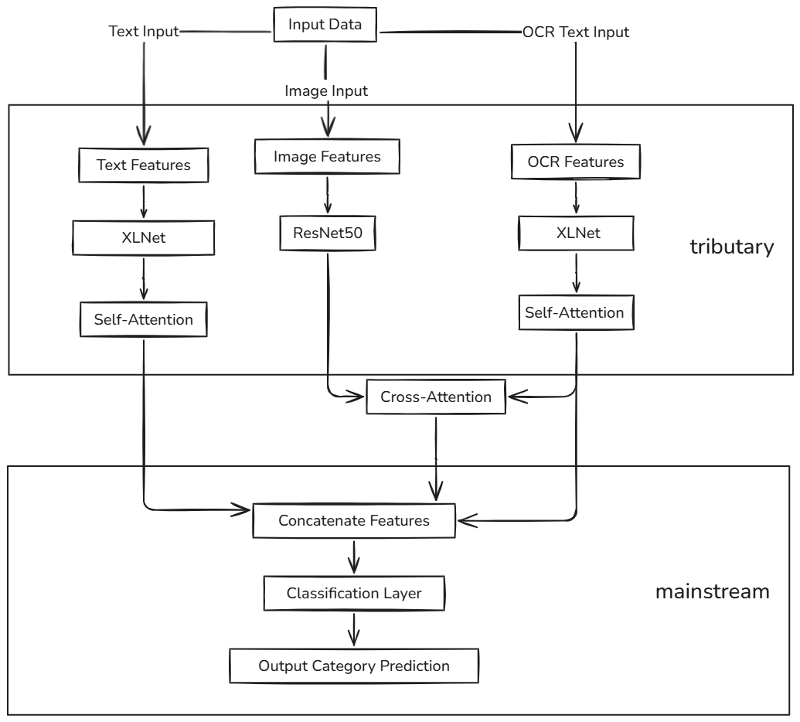
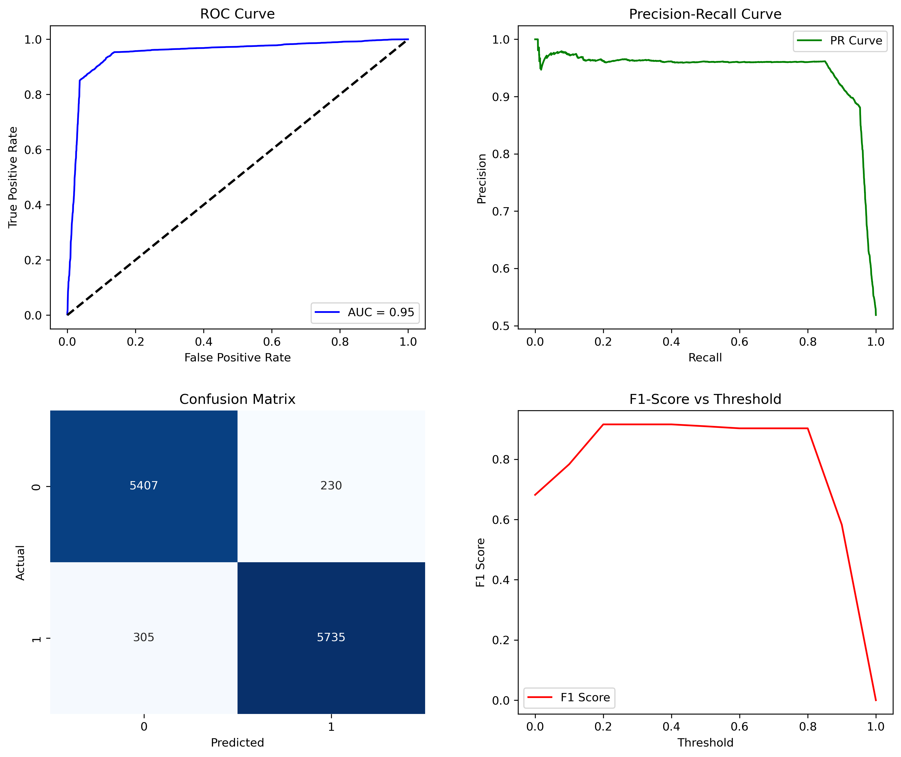

# 2024 广西公共数据开放创新应用大赛 - 多模态谣言二分类模型

---

 

## 项目简介
本项目开发了一个多模态谣言二分类模型，结合文本、图像，通过**模态衍生（图像ocr）** 、特征融合与模型策略实现了 **F1 Score: 0.9554**，在 2024 广西公共数据开放创新应用大赛中荣获初赛第一名。


## 项目结构
```
project
├── data                 # 数据集目录
├── model
│   └── xlnet           # XLNet 预训练模型
├── train
│   ├── scheme1         # 训练策略 1
│   └── scheme2         # 训练策略 2
│       ├── save        # 模型保存路径
│       │   ├── best_model.pth     # 最优模型
│       │   └── last_model.pth     # 最新模型
│       └── utils       # 工具代码
│           ├── model.py          # 模型定义
│           ├── train.py          # 训练脚本
│           └── dataset.py        # 数据集加载与预处理
│       └── main.ipynb    # 主训练与测试流程
```


## 数据
数据集包含以下模态：
1. **谣言文本**：谣言的核心文本信息。
2. **配图**：与谣言文本相关的图像数据。
3. **OCR 文本**：通过 [PaddleOCR](https://github.com/PaddlePaddle/PaddleOCR) 从配图中提取的文字信息。

链接:https://pan.baidu.com/s/1XH7YQGjXkjTZ9RYf7bVhmQ?pwd=2205 
提取码：2205 

ps：ocr.csv后缀的是通过ocr提取过特征的

## 训练策略
1. **优化器**：AdamW
2. **学习率调度**：余弦退火
3. **损失函数**：CrossEntropyLoss


## 融合策略
**中期融合（特征级融合）**：
- 通过 **交叉注意力机制** 融合插图与 OCR 文本特征。
- 两文本模态与交叉模态通过 `cat` 拼接后，送入线性层进行分类。


## 模型策略
1. **文本处理**：
   - 使用 [XLNet](https://arxiv.org/abs/1906.08237) 分别处理：
     - 谣言文本。
     - OCR 提取的插图文本。
2. **图像处理**：
   - 使用 [ResNet50](https://arxiv.org/abs/1512.03385) 提取图像特征。
3. **融合机制**：
   - 两文本模态先进行自注意力机制处理。
   - 图像模态与文本模态通过交叉注意力机制融合。
   - 将两文本模态与交叉模态特征 `cat` 融合后送入线性层。



## 使用方法

### 1. 数据准备
将数据集整合成指定格式后放入 `data` 目录，确保文件结构符合预期。（图像数据整理到`/data/images`中，表格整理成train.xlsx和test.xlsx置于`/data`中）

### 2. 训练模型
进入 `train/scheme` 目录，运行 `main.ipynb` 完成训练。

### 3. 模型评估
通过保存的 `best_model.pth` 进行推理测试。


## 结果展示
- **F1 Score**: 0.9554
- **排名**: 第 1 名


| 实验配置                               | 文本编码器  | 图像编码器   | 训练数据           | F1    | AUC   |
|----------------------------------------|-------------|--------------|--------------------|-------|-------|
| 完整模型                               | XLNet       | ResNet50     | OCR + 文本 + 图像  | 0.954 | 0.950  |
| 图像编码器替换为 ResNet18             | XLNet       | ResNet18     | OCR + 文本 + 图像  | 0.951 | 0.938 |
| 图像编码器替换为 VGG16                | XLNet       | VGG16        | OCR + 文本 + 图像  | 0.948 | 0.935 |
| 文本编码器替换为 BERT                 | BERT        | ResNet50     | OCR + 文本 + 图像  | 0.92  | 0.93  |
| 文本编码器替换为 ERNIE                | ERNIE       | ResNet50     | OCR + 文本 + 图像  | 0.918 | 0.928 |
| 去除 OCR（只使用文本 + 图像）         | XLNet       | ResNet50     | 文本 + 图像        | 0.91  | 0.925 |
| 去除图像（只使用 OCR + 文本）         | XLNet       | -            | OCR + 文本         | 0.92  | 0.915 |
| 去除图像和 OCR（只使用文本）          | XLNet       | -            | 文本               | 0.9   | 0.91  |
  



---

## 欢迎交流与贡献
如果您对本项目感兴趣，请访问并 Star 支持我们！
